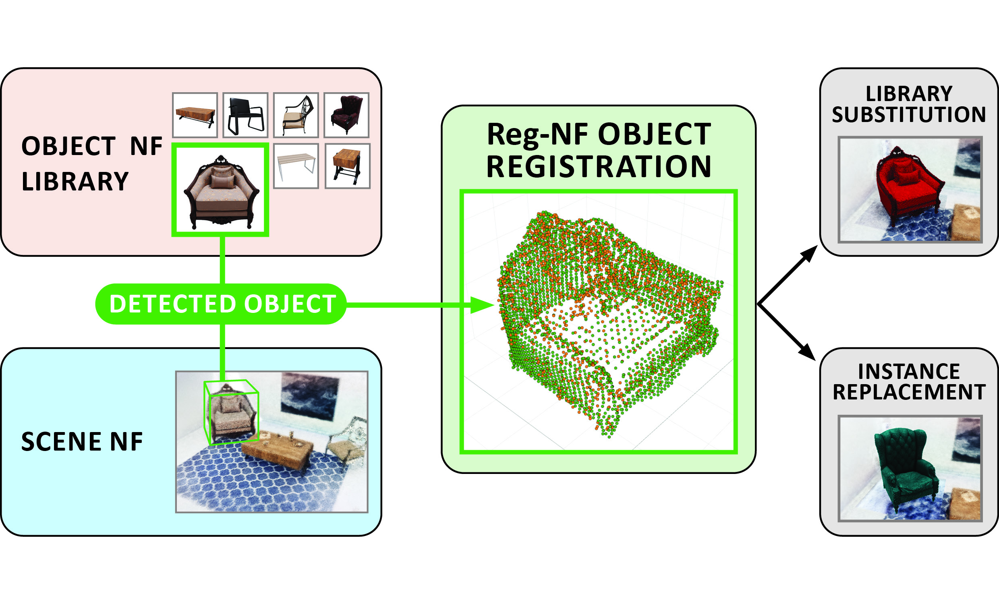
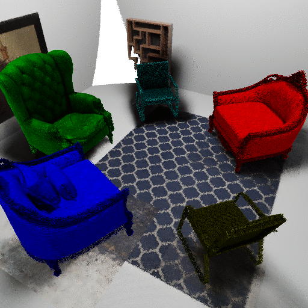
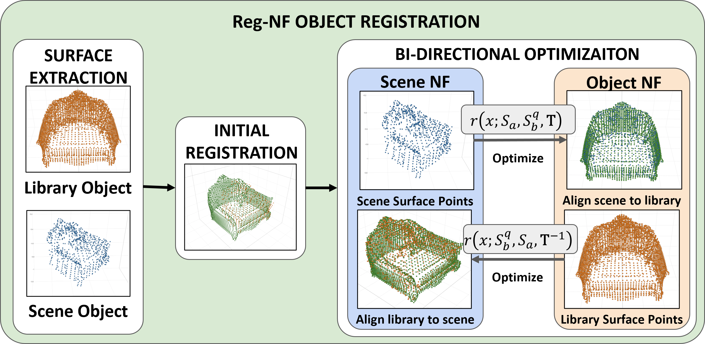
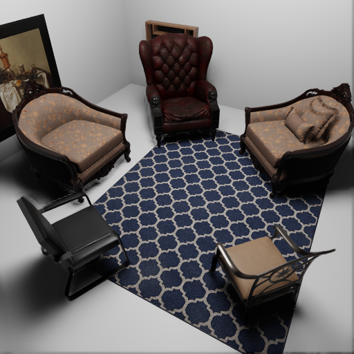
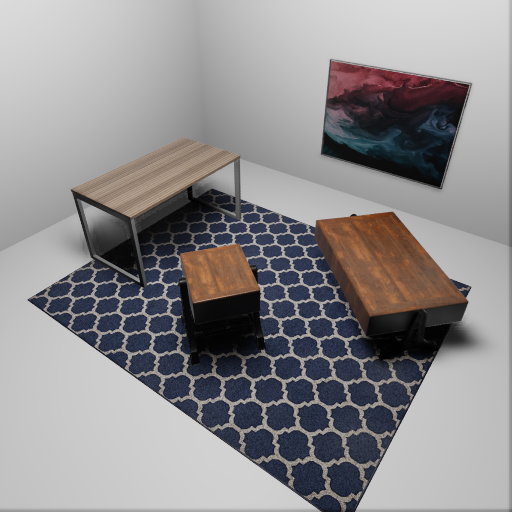
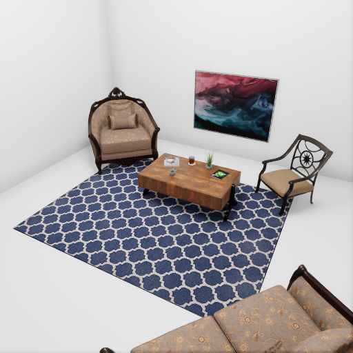
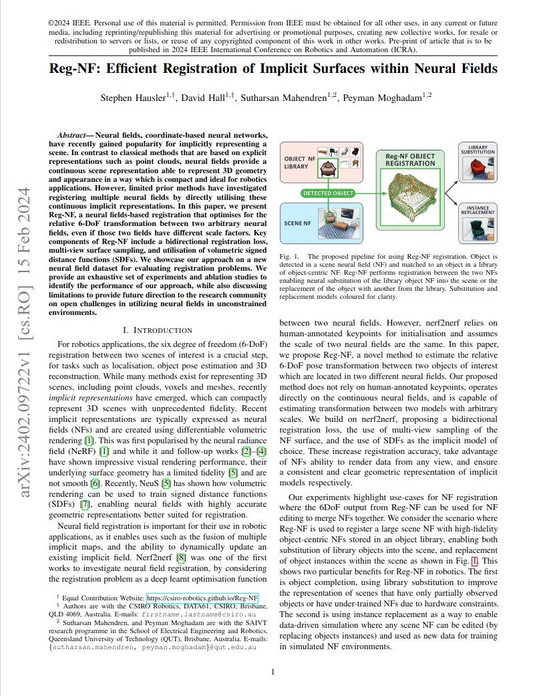

## [ICRA2024] Reg-NF: Efficient Registration of Implicit Surfaces within Neural Fields


### Contributions
* Provide method for estimating 6DoF pose transforms between two objects of interest located in different neural fields (NFs)
  - No human-annotated keypoints
  - operates directly on continuous NFs
  - robust to operating at arbitrary scale differences
* Bi-directional registration loss
  - multi-view surface sampling
* New object NF registration (ONR) dataset 
      

### Abstract

Neural fields, coordinate-based neural networks, have recently gained popularity for implicitly representing a scene. In contrast to classical methods that are based on explicit representations such as point clouds, neural fields provide a continuous scene representation able to represent 3D geometry and appearance in a way which is compact and ideal for robotics applications. However, limited prior methods have investigated registering multiple neural fields by directly utilising these continuous implicit representations. In this paper, we present Reg-NF, a neural fields-based registration that optimises for the relative 6-DoF transformation between two arbitrary neural fields, even if those two fields have different scale factors. Key components of Reg-NF include a bidirectional registration loss, multi-view surface sampling, and utilisation of volumetric signed distance functions (SDFs). We showcase our approach on a new neural field dataset for evaluating registration problems. We provide an exhaustive set of experiments and ablation studies to identify the performance of our approach, while also discussing limitations to provide future direction to the research community on open challenges in utilizing neural fields in unconstrained environments.


### Visual Summary

<p align="center">

</p>

Object Registration | Library Model Substitution | Scene NF Generation
:-: | :-: | :-:
<video src='assets/videos/dc_align_s2s.mp4' width=200 muted="" loop="" autoplay=""/> | <video src='assets/videos/substitute_incremental.mp4' width=200 muted="" loop="" autoplay=""/> | 

### Method
Reg-NF provides a method for aligning the surfaces of two different signed-distance-function (SDF) neural fields, by performing an optimization procedure to minimize the difference between the surface values between these two neural fields. An overview of our process is shown in the diagram below.
<p align="center">

</p>

#### Novel Bi-directional Optimisation 

After an initial registration step using sparse sampling of the neural fields, we introduce our bi-directional optimisation procedure. We use gradient decent to find the optimal 6-DoF pose transformation between two surface fields, accounting for translation, rotation and scale differences. Our loss function is the difference between surface values at a set of continuously updated sampling points, and by performing this process bi-directionally, we are robust to poor initial samples and to complex registration problems, such as large scale differences between different neural fields.

Through our experiments we show that our registration process outperformed the previous state-of-the-art in neural field registration as seen below.


### Results
Reg_NF is able to cope with registration of objects at different scale. 

nerf2nerf (Goli et al., 2023) | Reg-NF (ours)
:-: | :-:
<video src='assets/videos/dc_align_n2n.mp4' width=400 muted="" loop="" autoplay=""/> | <video src='assets/videos/dc_align_s2s.mp4' width=400 muted="" loop="" autoplay=""/>

#### Use-cases - Library model substitution
After registration, library models can be substituted into the scene model to help handle low-coverage or under-trained scenes.


<p align=center>
Library substitution in low-coverage scene model (not all angles observed for training model).

<video controls="" width="800" height="500" muted="" loop="" autoplay="">
<source src="assets/videos/low-coverage.m4v">
</video>
</p>

Under-trained model | Library sub. in under-trained model
:-: | :-:
<video src='assets/videos/vearly_original.mp4' width=400 muted="" loop="" autoplay=""/> | <video src='assets/videos/vearly_replace.mp4' width=400 muted="" loop="" autoplay=""/>

<!-- <p align=center>
caption1 | caption2
:-: | :-:
<video controls="" width="400" height="250" muted="" loop="" autoplay="">
<source src="assets/videos/vearly_original.mp4"></video> | <video controls="" width="400" height="250" muted="" loop="" autoplay="">
<source src="assets/videos/vearly_replace.mp4">
</video>
</p> -->

#### Use-cases - Library model replacement
As the relative poses of library object models are known, the calculated pose of objects in the scene can be used to replace the scene's object models with others from the library.
This opens up options for data-driven robotics where a NF scene can be changed to provide new data as shown below.

<p align="center">

</p>

#### ONR Dataset
The ONR dataset was built using the [Omniverse Isaac Sim](https://developer.nvidia.com/isaac-sim) simulator. and consists of 3 scenes in a standardised room and 8 object models (5 chairs and 3 tables). Object library models are trained from images of objects isolated in a void.

All Chairs Room | All Tables Room | Mix Room
:-: | :-: | :-:
 |  | 
matrix chair, fancy chair, dining chair, chair, fancy chair w. no pillows | willow table, end table, table | fancy chair, table, dining chair


### Download

Download the ONR dataset through the [CSIRO Data Access Portal](https://doi.org/10.25919/0vbj-fk61). See ReadME within portal for instructions on how to utilise the ONR dataset. 


### Code
 <p>
    We provide all the code used for registration of neural fielfs <a href="https://github.com/csiro-robotics/Reg-NF">in our GitHub repository</a> as well as code for utilizing our ONR dataset of simulated environments.
</p>

### Paper

The pre-print version of the paper is available on arxiv at: .

<div align="center">
            <a href="https://arxiv.org/abs/2402.09722">
            
            </a>   
            <p><a href="https://arxiv.org/abs/2402.09722"><strong>Pre-print of our  paper: "Reg-NF: Efficient Registration of Implicit Surfaces within Neural Fields"</strong></a></p>
</div>

### Citation
<p>
If you find this paper helpful for your research, please cite our paper using the following reference:

```
@inproceedings{hausler2024regnf,
	title = {Reg-{NF}: {Efficient} {Registration} of {Implicit} {Surfaces} within {Neural} {Fields}},
	shorttitle = {Reg-{NF}},
	doi = {10.1109/ICRA57147.2024.10610982},
	booktitle = {2024 {IEEE} {International} {Conference} on {Robotics} and {Automation} ({ICRA})},
	author = {Hausler, Stephen and Hall, David and Mahendren, Sutharsan and Moghadam, Peyman},
	month = may,
	year = {2024},
	pages = {15409--15415},
}
```
</p>